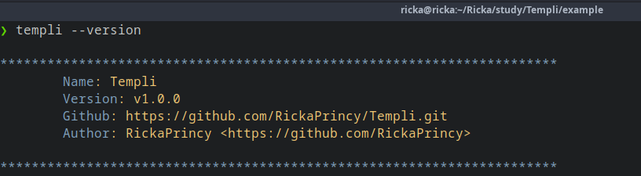
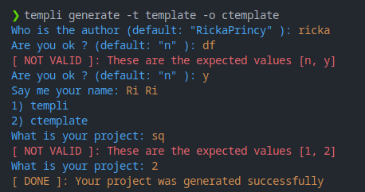
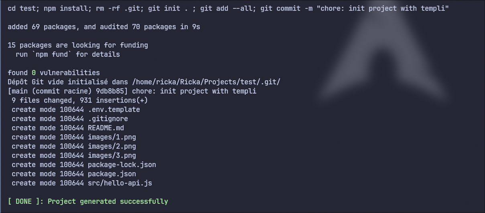

## Table of Contents

- [What is Templi?](#what-is-templi)
- [Installation](#installation)
    - [Arch Linux](#archlinux)
    - [Other Systems](#other-systems)
    - [Templi as Submodule](#templi-as-submodule)
- [Usage](#usage)
    - [1. Creating a Boilerplate](#1-creating-a-boilerplate-rocket)
    - [2. Setup and use the Boilerplate](#2-setup-the-boilerplate)
        - [Using CLI](#using-cli)
            - [1. Generate templi.json with: `templi configure`](#1-generate-templijson-with-templi-configure)
            - [2. Use the boilerplate with: `templi generate`](#2-use-the-boilerplate-with-templi-generate)
        - [Using Templi Library](#using-templi-library)
- [More Examples](#more-examples)
- [License](#license)

## What is Templi?



Templi is a tool that simplifies boilerplate creation and usage, available as both a library and a CLI. :rocket:

## Installation

### Archlinux

```bash
# install templi_cli and libtempli
yay -Sy templi_cli
or
# install libtempli 
yay -Sy libtempli
```
### Other Systems

For now, you need to build Templi manually if you're using a system other than Arch Linux.

- Requirements 
    - [CMake (Version 3.27 or later)](https://github.com/Kitware/CMake)
    - C++ Compiler with C++17 support
    - [rcli](https://github.com/RickaPrincy/rcli)

```bash
bash <(curl -s https://raw.githubusercontent.com/RickaPrincy/Templi/main/install.sh)
```

The script does the following:

```bash
git clone -b v4.0.0 https://github.com/RickaPrincy/Templi.git

cd Templi

mkdir build

cd build

cmake -DCMAKE_BUILD_TYPE=Release -S .. -B .

sudo make install

cd ../..

rm -rf Templi
```
#### :warning: If some libs are not found after building manually

Identify the installation path of the missing library. For example, let's assume the library is installed in `/usr/local/lib` (on linux it should be there).

If you are using Linux, add the following code to your `~/.zshrc` or `~/.bashrc` based on what you use (replacing `/usr/local/lib` with the actual installation path):

```bash
export LD_LIBRARY_PATH=/usr/local/lib:\$LD_LIBRARY_PATH
```

### Templi as submodule

1. **Add the Submodule:**
```bash
git submodule add https://github.com/RickaPrincy/Templi external/Templi 
```
2. **Initialize and Update**
```bash
git submodule init
git submodule update
```
3. **Link in CMake**
In `CMakeLists.txt`:

```cmake
add_subdirectory(path/to/templi)
target_link_libraries(your-target Templi)
```

## Usage 
### 1. Creating a Boilerplate

- **Create a Folder for Your Boilerplate**  
   Start by creating a folder where you will store your boilerplate files.

- **Insert Dynamic Placeholders in Your Files**  
   In each file, define dynamic values inside `{{}}` that you want to replace later.

Ex1: **setup.sh**
```bash
echo "Installing {{software}} version {{version}}"
```

Ex2: **package.json**
```json
{
    "name": "{{app_name}}",
    "author": "{{author}}",
    "license": "{{license}}",
    "version": "{{version}}",
    "private": {{is_private}}
}
```

Ex3: **folder/{{app_name}}/config.json**
```json
{
    "app_name": "{{app_name}}",
    "author": "{{author}}",
    "environment": "{{env}}"
}
```
Ex4: **Ex4: setup-{{app_name}}.sh**
```bash
echo "Setting up {{app_name}}..."
```

### 2. Setup and use the Boilerplate
To make your boilerplate work with templi, a `templi.json` file is required in the root of your project. This file tells Templi how to retrieve placeholder values and configure other settings.

#### Using CLI

##### 1. Generate `templi.json` with: `templi configure`

```bash
templi configure -t <path_to_the_boilerplate>` 
# -t or --template
#if path is not given from option, it will be prompted 
```

Example: 


Example of `templi.json` generated:

```json
{
    "excludes": [
        "templi.json"
    ],
    "placeholders": [
        {
            "name": "app_name",
            "label": "What is the value of : app_name ?",
            "type": "input"
        },
        {
            "name": "author",
            "label": "What is the value of : author ?",
            "type": "input"
        },
        {
            "name": "is_private",
            "label": "What is the value of : is_ok",
            "type": "input"
        }
    ] 
}
```
For more information on how to customize templi.json, see this [file](./templi.json.md).

##### 2. Use the boilerplate with: `templi generate` 

```bash
templi generate -t <path-to-the-template> -o <path-to-the-output>
# -t or --template
# -o or --output
# -s or --scope (optional) (for monorepo templates)
# if one the option is not given, the it will be prompted 
```  

**Output example:** 




#### Using Templi library

```c++
//Signature
namespace Templi
{
    // To configure Boilerplate
	void configure(std::string template_path);

    // Generate without templi.json
	void generate(std::string template_path,
		std::string output_path,
		std::map<std::string, std::string> values,
		std::vector<std::string> ignored_path = {});

    // Generate with templi.json
	void generate_with_templi_config(std::string template_path,
		std::string output_path,
		std::function<std::string(Key key)> get_key_value);

    // Useful when you want to read a template.json file or save a config
	class TempliConfig
	{
	public:
		std::vector<std::string> m_excludes{}, m_before{}, m_after{};
		std::vector<Key> m_placeholders{};

		void read(std::string template_path);
		void save(std::string template_path);

		TempliConfig() = default;
		TempliConfig(std::string template_path);
	};	// TempliConfig

}  // namespace Templi

//Example for Templi::generate
Templi::generate("template", "output_path", {
    {"name", "Templi"},
    {"version", "1.0.0"},
    {"date", "2023-01-01"},
    {"Me", "RickaPrincy"},
    {"functionName", "sayHelloWorld"}
});
```

## More Examples

[templi-express-js](https://github.com/RickaPrincy/templi-express-js)


[templi-templates](https://github.com/RickaPrincy/templi-templates)

## License

This project is licensed under the [MIT License](License.txt).
