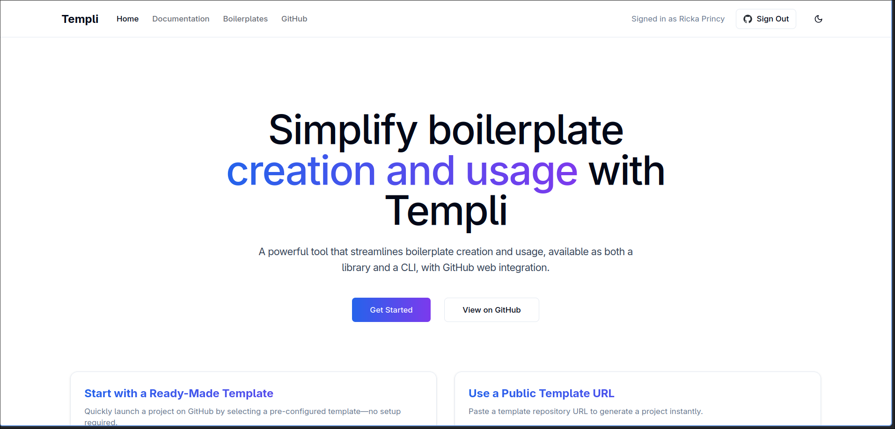

<div align="center">



# Templi

**Turn any folder into a reusable project template. Generate new projects from it in seconds.**

[](https://github.com/RickaPrincy/Templi/actions/workflows/ci.yml)
[](https://aur.archlinux.org/packages/templi_cli)
[](./License.txt)
[](https://en.cppreference.com/w/cpp/17)

[Documentation](https://templi.vercel.app) · [`templi.json` reference](./templi.json.md) · [Report a bug](https://github.com/RickaPrincy/Templi/issues)

</div>

---

Stop copy-pasting your last project and renaming things by hand. Put `{{placeholders}}` in any folder
(file contents **and** file names), and Templi asks for their values, copies the folder, and fills everything in.
Templates can be local folders or git repositories, and can run scripts before and after generation.

```console
$ templi generate -t https://github.com/me/cpp-template.git -o my_app
Cloning the template to https://github.com/me/cpp-template.git ...
? Project name my_app
? License MIT                    ← chosen with the arrow keys
? Add tests? (y/n) y

[ DONE ]: Project generated successfully
```

## ✨ Features

- 🧩 **Placeholders everywhere**: `{{PROJECT_NAME}}` works inside files, in file names and in folder names
- 💬 **Interactive prompts**: text, yes/no and arrow-key selection, with input validation
- 🌍 **Git templates**: pass a URL ending in `.git`, Templi clones it, generates, and cleans up
- 🗂️ **Monorepos of templates**: pick one sub-template with `--scope`
- ⚡ **Non-interactive mode**: give any placeholder on the command line (`--PROJECT_NAME demo`), perfect for scripts and CI
- 🪝 **Hooks**: shell scripts before and after generation (`git init`, `npm install`, ...)
- 🚫 **Excludes**: skip files entirely, or copy binaries and assets without parsing them
- 🛠️ **Zero-effort setup**: `templi configure` scans a template and writes its `templi.json` for you
- 📦 **Also a C++ library**: embed template generation in your own tools

## 📦 Installation

### Arch Linux

```bash
yay -S templi_cli
```

### From source (any system)

You only need CMake ≥ 3.18 and a C++17 compiler: the dependencies ([rcli](https://github.com/RickaPrincy/rcli)
and [cpp_inquirer](https://github.com/RickaPrincy/cpp_inquirer)) are header-only and downloaded automatically.

```bash
git clone https://github.com/RickaPrincy/Templi.git
cmake -S Templi -B Templi/build -DCMAKE_BUILD_TYPE=Release
cmake --build Templi/build
sudo cmake --install Templi/build   # installs the `templi` command
```

## 🚀 Quick start

### 1. Make a template

Any folder is a template. Write placeholders as `{{NAME}}`:

```
my-template/
├── CMakeLists.txt          project({{PROJECT_NAME}} VERSION {{VERSION}})
├── README.md               # {{PROJECT_NAME}} by {{AUTHOR}}
└── src/
    └── {{PROJECT_NAME}}.cpp
```

### 2. Configure it

```bash
templi configure -t my-template
```

Templi finds every placeholder and writes `my-template/templi.json`. Edit it to choose how each value is asked:
labels, types (`TEXT`, `BOOLEAN`, `SELECT`), choices, validators, excludes and scripts.

```json
{
  "copy_excludes": ["templi.json"],
  "parse_excludes": ["templi.json", "assets/**"],
  "scripts": {
    "after": ["cd {{TEMPLI_OUTPUT_FOLDER}} && git init"]
  },
  "placeholders": [
    { "name": "PROJECT_NAME", "label": "Project name", "type": "TEXT",
      "validators": [{ "pattern": "required" }, { "pattern": "^[a-z_]+$", "message": "lowercase and _ only" }] },
    { "name": "LICENSE", "label": "License", "type": "SELECT", "choices": ["MIT", "GPL"] },
    { "name": "USE_TESTS", "label": "Add tests?", "type": "BOOLEAN" }
  ]
}
```

Everything is described in the [`templi.json` reference](./templi.json.md).

### 3. Generate projects

```bash
templi generate -t my-template -o my_app
```

## 🧭 Commands

| Command | What it does |
|---------|--------------|
| `templi generate` | Generates a project from a template |
| `templi configure` | Scans a template and creates (or updates) its `templi.json` |
| `templi --version` | Shows the version |
| `templi <command> --help` | Shows the options of a command |

### `generate` options

| Option | Description |
|--------|-------------|
| `-t, --template <path>` | Template folder, or git URL ending in `.git` (asked if missing) |
| `-o, --output <path>` | Output folder (asked if missing) |
| `-s, --scope <folder>` | Sub-folder of the template to use (monorepo of templates) |
| `--<PLACEHOLDER> <value>` | Value of a placeholder: it is not asked anymore |

Placeholders not given on the command line are asked interactively. Give them all to generate without any prompt:

```bash
templi generate -t my-template -o my_app --PROJECT_NAME my_app --VERSION=1.0.0 --AUTHOR me
```

When the input is not a terminal (pipes, CI), prompts switch to plain lines and lists become numbered choices,
so you can also pipe the answers: `printf 'my_app\n1\ny\n' | templi generate -t my-template -o my_app`.

### `configure` options

| Option | Description |
|--------|-------------|
| `-t, --template <path>` | Template folder (asked if missing) |

Running `configure` again on a template keeps its existing `copy_excludes` and `parse_excludes`.

## 🧠 How generation works

```
 template/ ──► before scripts ──► copy (minus copy_excludes) ──► replace {{placeholders}} ──► after scripts
                                                                  in files (minus parse_excludes)
                                                                  and in file / folder names
```

All the values are collected first. In scripts, every `{{placeholder}}` is replaced too, and
`{{TEMPLI_OUTPUT_FOLDER}}` gives the output folder.

## 📚 Use Templi as a C++ library

```cmake
include(FetchContent)
FetchContent_Declare(Templi GIT_REPOSITORY https://github.com/RickaPrincy/Templi.git GIT_TAG main)
FetchContent_MakeAvailable(Templi)

target_link_libraries(your_target PRIVATE Templi)
```

```c++
#include <Templi/Templi.hpp>

// with the placeholders of templi.json, values supplied by your own code
Templi::generate_with_templi_config("my-template", "my_app",
	[](const Templi::Placeholder &placeholder) -> std::string
	{ return placeholder.m_name == "PROJECT_NAME" ? "my_app" : "value"; });

// or without templi.json, with explicit values
Templi::generate("my-template", "my_app", { { "PROJECT_NAME", "my_app" } });

// write templi.json for a template
Templi::configure("my-template");
```

Errors are reported as `Templi::Exception`.

## 🧪 Development

```bash
# tests need GoogleTest (e.g. `sudo pacman -S gtest`). CMAKE_BUILD_SHARED_LIBS=ON disables the fully static
# link used for releases, which a shared GoogleTest (like the Arch package) cannot be part of.
cmake -S . -B build -DCMAKE_BUILD_SHARED_LIBS=ON
cmake --build build
ctest --test-dir build --output-on-failure
./build/bin/templi --help
```

### Releasing

1. Bump `project(templi_tools VERSION x)` in `CMakeLists.txt`, configure once (it regenerates
   `include/Templi/TempliConfig.hpp` and the PKGBUILDs), commit and push.
2. Actions > **release** > **Run workflow** (or push the tag `v<version>`): the tests run, then
   `tools/package_release.sh` builds `templi-cli-linux-x86_64@<version>.tar.gz` and
   `templi-lib-linux-x86_64@<version>.tar.gz`, and the GitHub release is published.
3. Run `updpkgsums` in `PKGBUILD/cli` and `PKGBUILD/lib`, commit, push, then run the AUR workflows.

## 🙌 Built with

- [rcli](https://github.com/RickaPrincy/rcli): command line parsing
- [cpp_inquirer](https://github.com/RickaPrincy/cpp_inquirer): interactive prompts
- [nlohmann/json](https://github.com/nlohmann/json): `templi.json` parsing

## 📄 License

MIT © [RickaPrincy](https://github.com/RickaPrincy). See [License.txt](./License.txt).
